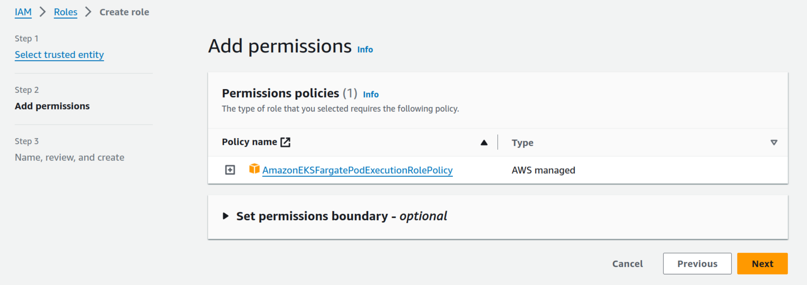
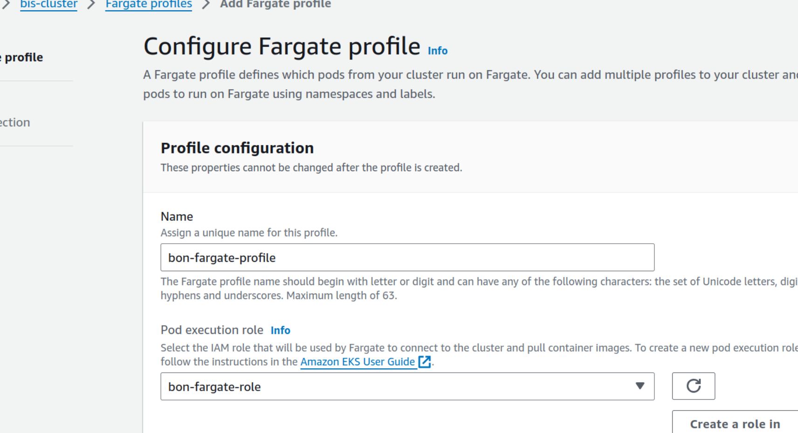
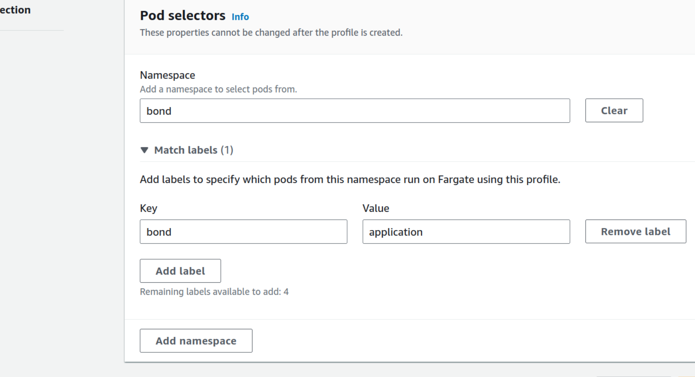
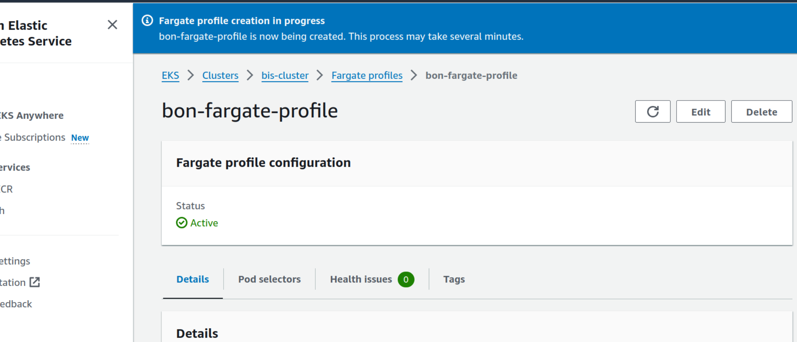
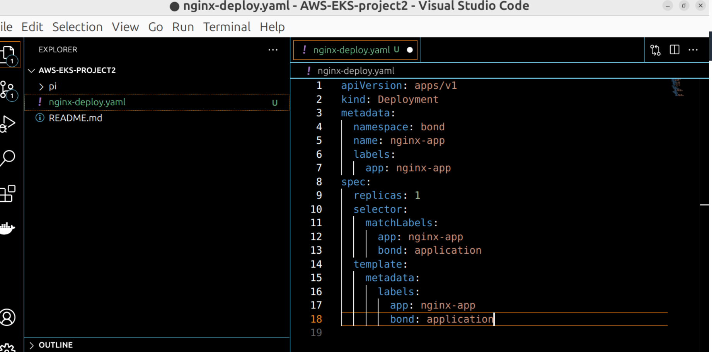
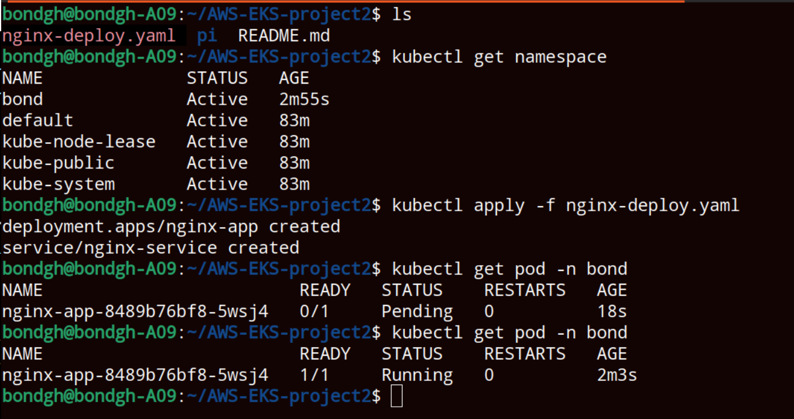

<h1>AWS EKS Fargate Profile</h1>
<h2>Technologies used</h2>

- <b>Kubernetes</b> 
- <b>AWS EKS</b>
- <b>AWS Fargate</b>

<h2>Detailed Description of Project </h2>
1. Create Fargate IAM Role 
2. Create Fargate profile 
3. Deploy an example application to EKS cluster using Fargate profile 

   

   <h2>step 1    Create Fargate IAM Role</h2>
   From AWS IAM service, Create IAM role for EKS fargate pod 
   Attach  'AmazonEKSFargatePodExecutionRolePolicy' 
  
   

 

   <h2>step 2  Create Fargate Profile</h2>
   Create a fargate profile from the cluster compute  
   Deploy an example application to EKS cluster using Fargate profile 
  
   

  Configuration of fargate rules 
  Selectors are required to indicate pod needed to be scheduled by fargate 
   

  Fargate profile is created and active 
   
  
  
  
  Selectors created must be added to the pod configuration file 
   

  The deployment and service are created in the the cluster 
  AwS configures fargate and run application on it 
   
  
  

  

   
     

